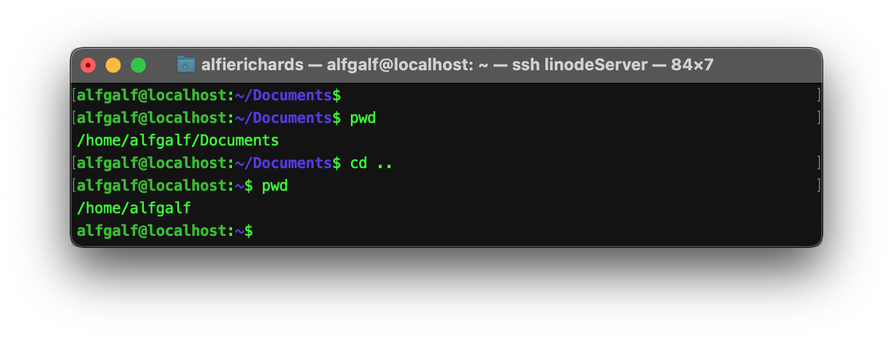
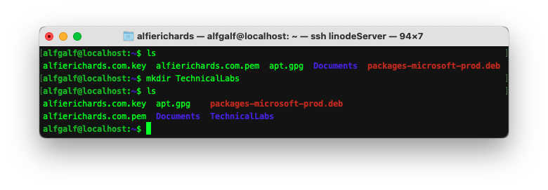
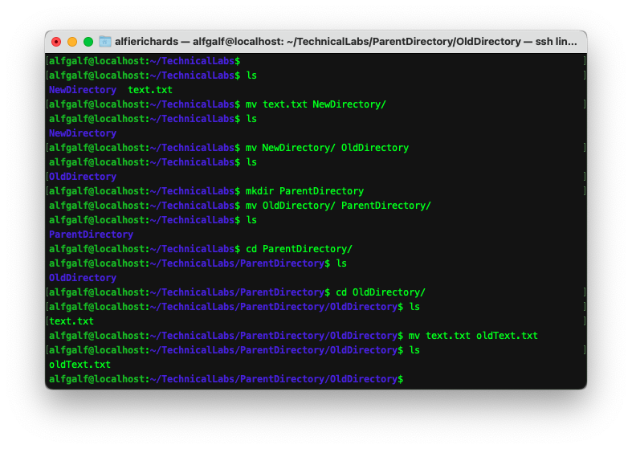
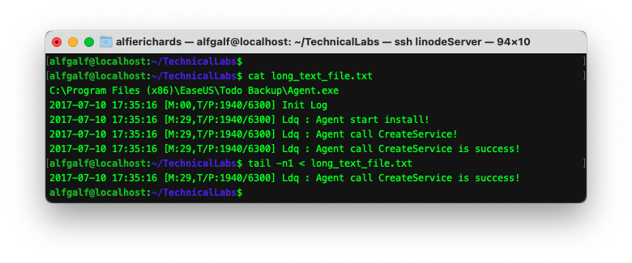

UNIX Shell
==========

What is UNIX
------------

When people say UNIX they noramlly mean the family of UNIX-like operating systems that derive from 
the original AT&T UNIX operating system. The original UNIX was written, along with the C programming 
language, in the 1970's by Ken Thompson, Dennic Ritchie and others. There are a lot of UNIX-like 
operating systems, MacOS and Linux being the two most popular for dektop along with iOS and Android 
for mobile.

UNIX is characterised by its modular design where functionality is made up by simple tools, each of 
which perform well defined functions, and can be combined to together become more complex.
UNIX operating systems consist of many librarys and utilities along with a master control program, 
the kernal, which handles starting and stopping programs, handles the file system, and other low 
level tasks that programs share.

UNIX was instrumental in the development of the intenet and still makes up the vast majority of the 
machines that make up the internet.

What is the shell?
------------------

The shell is the command-line interpreter for UNIX-like operating systems. Users can control the 
operating system through the shell which is both a command language and a scripting language. Users 
tend to interact with the ith shell through a terminal emulator. Which, as the name suggests, 
emulate old style computer terminals. This is normally the "Terminal" app on your computer.

In essense, the shell is the language and syntax you use to input commands and scripts into the 
terminal emulator. The terminal emulator then sends those commands to the unix operating system 
which either runs librarys installled or runs utilities from the kernal. then the output is sent 
back to the terminal emulator and displayed.

The most common shell is the Bourne Again SHell, or bash for short, but shells like the Z SHell 
(zsh) and the Friendly Interactive SHell (fish) are gaining in popularity. We'll be using bash.

How to install a UNIX like command line on your computer
--------------------------------------------------------

For mac and linux users this answer is very simble. You are already running on a UNIX-like operating 
system, Install the terminal emulator of your choice (or use the pre installed options) and you're 
ready.

For Windows the answer is more complicated. As windows is not a UNIX-like operating system it doesnt 
use a UNIX shell, instead it uses powershell, which isnt very widely used and is incompatible with 
most UNIX tools.

However all is not lost! With Windows 10 Microsoft added a full Windows subsystem for Linux, which 
allows Windows users to use a UNIX shell, like bash, and most all of the GNU utilities that make up 
linux, just without the linux kernal! 

To install go to [this 
page](https://www.howtogeek.com/249966/how-to-install-and-use-the-linux-bash-shell-on-windows-10/) 
which gives instructions on installing a bash shell, then most everything should be the same from 
there on out.

How to use the UNIX shell
-------------------------

When you open the terminal you will be presented with a __prompt__, this will look something like 

```
user:~$
```

This will be where you write commands. The dollar symbol comunicates you you are not the root user, 
but we'll get to that later.

There are a few things to be aware of when using a UNIX shell, where you are and who you are. 

### Where

The where is what directory are you in? In a UNIX shell you are always have a working directory. To 
find your current working directory use the command "print working directory" which is abbreviated 
to `pwd`.


Then you can see the shell returns the current directory. If you've just started the shell you'll be 
in your users __home directory__. In UNIX you can always find the home directory as `~` represents 
the current users home directory, thats why it is in the prompt, thats your current directory.

To change the working directory use the `cd` (change directory) command followed by where you want 
to go.


You can also either use local file paths, from your current directory, or use the absolute path from 
the base directory.


To list all the directories and files in the working directory use the `ls` command, short for 
"list".


In unix any directories starting with a fullstop are hidden by default, to show these hidden files 
add the `-a` flag to the `ls` command.


There you can see some unexpected entries, what are `.` and `..`? In UNIX in every directory there 
is `.` to represent the current directory, and `..` to represent the parent directory.

Combining this with cd and relative paths we can use `cd ..` to navigate to the parent directory.



### Who

All UNIX based systems have a user system, and different users can access different files and 
different commands.

You can check what user you are with the `whoami` command.


You can then change users by using the `su` command followed by the user you want to switch to 
("root" is the super user in unix sho has all privaledges, you shouldnt normally work as root 
because you might do something destructive by accident). The shell makes it clear you're root as the 
`$` is replaced by a `#`, and the prompt may change also.


If you want to run just one command as the `root` user, a very common occurence, you can use the 
`sudo` command followed by the command you want to run. This will normally promt you for an 
administrator users password or the root users password.

Basics of UNIX
--------------

Now you know the basics of getting around and how to change user lets start using some commands!

In the UNIX-shell a command is structured with the name of the command, then some arguments.


Here in red you can see the "Command", in this case `git` (the subject of a future lab), followed by 
a list of arguments in blue. 

The command can fall into a few catagories:

1. __Internal commands__ - certain commands fall into the remit of the operating system, like 
   managing the file system, these commands are managed by the OS 'kernal' and dont rely on any 
   executables.
2. __Included commands__ - some binaries come included with your operating syste and are considered 
   part of the operating system.
3. __External commands__ - executables the user has installed

If the command comes in the first category then the shell hands the job straight off to the kernal 
to handle.
But otherwise the shell has to find the command you want to run, so it goes and looks for 
executables with the name you specified in special directories. These directories are spcified by 
the PATH variables, which will be covered later. 

Parameters are seperated by spaces, unless they are surrounded in speach marks in which case that is 
treated as one parameter.
One common style of parameter are "flags". These look like the `-a` and `-m` above and generally 
alter the commands behaviour in some way.

Different commands take different parameters in different orders, you can find a manual for any 
command and a list of parameters for any command on the "man" page, by running `man <command name>` 
and then exit the page by pressing the `q` key.

File management in UNIX
-----------------------

One of the first things you may want to do is manage files and directories. All of which can be done 
with a UNIX shell.

### Making Directories

Making a directory is as simple as `mkdir <directory name>`



### Moving and renaming files and directories

The `mv` command pulls double duty, it allows you to move a file or directory from one file path to 
another. That means you can move a file from one directory to another, `mv <current directory 
path>/<file name> <new directory path>`

Or move a directory to another directory `mv <current directory path> <path of directory to move it 
to>`

Or to rename a file or directory `mv <file name> <new file name>`



### Deleting files and directories

To delete a file use the `rm <file path>` command.

To delete a directory use the `rmdir <file path>` command, but this can only be done on empty 
directories.

To delte a directory and its contents use the `rm` command with the `-r` flag to delete recursively.

___Warning___ In UNIX there is no "trash" directory where delted files go. When you delete a file it 
is gone. 


### Copying files and directories

Copying is handled by the `cp` command, which is the same as the `mv` command but moves a copy of 
the file or directory to the new file path.

What are the "PATH variables"
-----------------------------

Earlier we said the shall was a scripting langage, and like any other programming language it can 
make use of variables. The command `export <variable name>="<data>"` defines a variable.

Then by writing `$<variable name>` you can retrieve the value and put it in a string.


The `echo <argument>` command simply returns the parameter given.

Then finally we can look at the "PATH variables"


And you see a big list of file directories, this is where the shell goes looking for the executables 
you want to run. You can go lookin the directories themselves but if you need to find one particular 
executable you can use the `which <command>` command.


You can run executables directly with their absolute path or local path also, this is how you could 
run executables you make yourself without putting them in the path directories!


Connecting programs together
----------------------------

Unix programs can take input and return output, they do this through two primary streams, the input 
stream and the output stream. By default the input stream is the terminal emulator and the ouput 
stream is also the terminal emulator. 

If you've ever written a python program the `input()` statement reads the input stream and the 
`print()` statement writes to the output stream. 

But the streams need not just be those standard inputs and outputs.
You can use the `>` operator after a command to save the result to a file.


The `cat <file path>` command reads a file and outputs it to the standard out stream.

You can use the `<` operator to use a file as the input stream for a command.



The `tail -n1` command returns the last line of the input stream.

And lastly, you can connect one program to another with a pipe, `|`. With a pipe you can take the 
output or one program and feed it into another.


Here the `ip a` command lists lots of networking information, but I only want the line about the ip 
address starting "127." so I use the `grep <string>` command that lets you search the standard in 
stream for strings and outputs the lines containing the strings.

Going forward
-------------

Hopefully you now know how to move around the shell, change users, manage files, and accoplish basic 
tasks. Also, hopefully if you're going through a tutorial online you will know more of whats going 
on. 

Theres a lot more you can do with the shell, we'd be here for whole semesters going through it all, 
some more will be covered in future advanced labs but mostly you should go out and find how to do 
stuff yourself! Theres a massive amount of material online to help you! Man pages are your friend, 
if you dont understand a command never be afraid to look into the man pages for it!

Exercises
---------

If you want to work on your UNIX skills heres some things to do:

1. Install and open a UNIX shell!
2. Navigate to your home folder and then explore the file system. Use `cd`, `ls`, and `pwd` to get 
   around.
3. Create a new directory
4. Rename a directory
5. Look up the `touch` command
6. Make some files!
7. Look into UNIX permission system and change some permissions!
8. Try playing around with `<`, `>`, and `|`.
9. Look at your PATH variables, try find the binary of a command you know.

